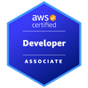
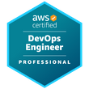

# About me

- Name: Mattia Peri
- Location: Milan
- Personal Website: [mattiaperi.it](https://www.mattiaperi.it)
- e-mail: [$NAME@mattiaperi.it](#)
- LinkedIn: [linkedin.com/in/mattiaperi/](https://www.linkedin.com/in/mattiaperi/)
- Technical Product Manager & DevOps Architect

## Intro
My name is Mattia Peri and I am a dedicated professional in the field of cloud computing, with a focus on AWS (Amazon Web Services). I am passionate about creating innovative and efficient solutions to address complex business challenges.

### Languages
- Italian 🇮🇹 (native)
- English 🇬🇧

## Professional Overview
<!-- *Publications* -->
<!-- *Background* -->

*__Areas of Expertise__*
- Cloud Governance (Policy as Code on AWS Multi-account strategies)
- Microservice Architecture Pattern
  - Migration monolithic to container services on both EKS/Kubernetes and ECS
  - Deployment Strategies
  - Horizontal and Vertical Amazon EKS cluster and pod scaling (Karpenter)
  - Amazon EKS multi-tenant scenarios (including network policies for true segmentation)
- Infrastructure as Code (IaC using Terraform)
  - Policy as Code (Terraform Cloud and AWS)
  - Configuration Management
- GitOps
  - ArgoCD
- CI/CD (Jenkins, CodePipeline, others)
- DevSecOps (embed security within CI/CD pipelines, image scanning etc)

*__Current Role__*

I currently work for AWS as a DevOps Architect in the Professional Services organization. In this role, I leverage my technical skills, knowledge, and experience to assist AWS customers in achieving their cloud transformation goals. As a DevOps Architect, I am responsible for designing and implementing solutions that enable organizations to optimize their processes, enhance agility, and deliver value to their customers more efficiently.

What is Professional Services in AWS?
AWS Professional Services is a dedicated team of experts within Amazon Web Services. Our mission is to help customers achieve their business objectives by providing guidance, expertise, and hands-on assistance in architecting, building, and optimizing their AWS infrastructure and applications. In summary, AWS Professional Services is dedicated to helping organizations harness the full potential of the AWS platform, enabling them to innovate and scale their businesses with confidence.

*__Previous experience__*
As Technical Product Manager, I leaded the Kubernetes technology adoption within the company by building the medium and long-term strategy and execution operating model. Acting as a principal advisor for the cloud-native approach, I guided executives stakeholders responsible for a leading Fashion and Luxury company front-end and back-end core services in using the latest technologies within their team to automize activities and have a positive impact on budget resources. 

### Accolades & Certifications
I hold 3x AWS Certifications (**AWS Certified Solutions Architect - Associate**, **AWS Certified DevOps Engineer - Professional** and **AWS Certified Developer - Associate**), these certifications are an expression of the expertise gained in the field in designing distributed systems and architectures on the AWS platform. Over the years, I have built a strong foundation in cloud computing, infrastructure as code, and automation, making me a trusted resource for my customers.

## Personal Touch
On a personal note, I am not only passionate about my work but also deeply committed to my family. I am the proud father of a beautiful daughter who continually inspires me to strive for excellence in all aspects of my life.

In conclusion, I am thrilled to be a part of the AWS community, and I look forward to contributing my expertise and experience to help organizations succeed in their cloud journey. Thank you for taking the time to learn more about me, and I welcome any questions or discussions you may have.

*I work for @AWSCloud & my opinions are my own.*